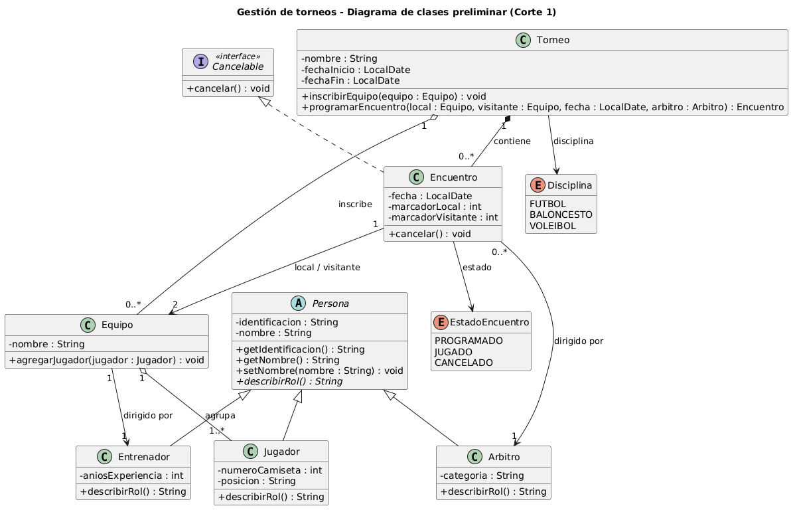

# Corte 1 — Análisis, diseño y estructura inicial

> Complete todas las secciones. Elimine las indicaciones entre `< >` al terminar.

## 8.1 Identificación

```text
Caso seleccionado: CASO 4. Gestion de torneo
Integrante 1:Christopher Chavarria Solorzano
Integrante 2: (trabajo individual)
URL del repositorio: https://github.com/ChristopherChavarria/examen1programacion2-chavarria
```

## 8.2 Descripción del problema

**Problema que se desea resolver:**

Las organizaciones que realizan torneos por lo general llevan el control de equipos, jugadores, encuentros y resultados en un papel o en hojas de lineas , esto lo que hace es un desorden y es mas facil cometer errores, como meter a un jugador en 2 equipos, hacer por ejemplo un equipo contra si mismo etc. Lo que se busca es como mantener esa informacion en un sistema y aplicar las reglas del torneo de manera automatica.

**Quién utilizaría el sistema:**

El personal que organiza el torneo para llevar cada cosa como debe de ser inscribir al torneo a las personas , crear los equipos , programar los encuentros

**Principales operaciones:**

- Registrar torneos con su disciplina y fechas.
- Registrar equipos con sus jugadores y su entrenador.
- Inscribir equipos en un torneo.
- Programar encuentros entre dos equipos y asignarles un árbitro.
- Registrar el resultado de un encuentro.
- Cancelar un encuentro.
- Consultar los encuentros y la tabla de posiciones de un torneo.

**Justificación de la elección del caso:**

Se eligió este caso porque el funcionamiento de un torneo es familiar y sus reglas son fáciles de entender. Además, permite aplicar los temas del curso: herencia con una clase Persona de la que derivan Jugador, Entrenador y Arbitro; enumeraciones para el estado de los encuentros; y reglas de negocio claras para validar.

## 8.3 Requerimientos funcionales

```text
RF-01. El sistema permitirá registrar torneos indicando su nombre, disciplina y fechas.
RF-02. El sistema permitirá registrar equipos con sus jugadores y su entrenador.
RF-03. El sistema permitirá inscribir equipos en un torneo.
RF-04. El sistema permitirá programar encuentros entre dos equipos de un torneo, asignándoles fecha y árbitro.
RF-05. El sistema permitirá registrar el resultado de un encuentro.
RF-06. El sistema permitirá cancelar un encuentro programado.
RF-07. El sistema permitirá consultar los encuentros de un torneo.
RF-08. El sistema permitirá consultar la tabla de posiciones de un torneo.
RF-09. El sistema no deja que un jugador pertenezca a dos equipos del mismo torneo.
RF-10. El sistema no deja programar un encuentro de un equipo contra si mismo.
RF-11. El sistema no deja registrar resultados con marcadores negativos o en encuentros cancelados.
```

## 8.4 Identificación de clases

| Clase | Responsabilidad | Atributos principales |
|---|---|---|
| Persona (abstracta) | Representar los datos comunes de toda persona que participa en un torneo | identificacion, nombre |
| Jugador | Representar a un jugador que pertenece a un equipo | numeroCamiseta, posicion |
| Entrenador | Representar a la persona que dirige un equipo | aniosExperiencia |
| Arbitro | Representar a la persona que dirige un encuentro | categoria |
| Equipo | Agrupar a los jugadores y al entrenador que compiten juntos | nombre, jugadores, entrenador |
| Torneo | Representar una competencia y contener sus equipos inscritos y sus encuentros | nombre, disciplina, fechaInicio, fechaFin, equipos, encuentros |
| Encuentro | Representar un partido entre dos equipos, con su árbitro y su resultado | equipoLocal, equipoVisitante, fecha, arbitro, marcadorLocal, marcadorVisitante, estado |

## 8.5 Relaciones entre clases

| Clases relacionadas | Tipo (asociación / agregación / composición / herencia) | Multiplicidad | Explicación |
|---|---|---|---|
| Persona — Jugador, Entrenador, Arbitro | Herencia | — | Jugador, Entrenador y Arbitro son tipos de Persona: heredan identificación y nombre, y cada uno agrega sus propios atributos. |
| Torneo — Encuentro | Composición | 1 a 0..* | Un torneo contiene sus encuentros. Un encuentro no existe fuera del torneo al que pertenece. |
| Torneo — Equipo | Agregación | 1 a 0..* | Un torneo tiene equipos inscritos, pero el equipo existe por sí mismo aunque el torneo termine. |
| Equipo — Jugador | Agregación | 1 a 1..* | Un equipo agrupa a sus jugadores. El jugador sigue existiendo si el equipo se disuelve. |
| Equipo — Entrenador | Asociación | 1 a 1 | Cada equipo es dirigido por un entrenador. |
| Encuentro — Equipo | Asociación | 1 a 2 | Cada encuentro enfrenta a dos equipos: el local y el visitante. |
| Encuentro — Arbitro | Asociación | 0..* a 1 | Cada encuentro tiene un árbitro asignado, y un árbitro puede dirigir muchos encuentros. |

## 8.6 Herencia o abstracción

```text
<Superclase>
├── <Subclase 1>
└── <Subclase 2>
```

**Justificación:**

<texto>

## 8.7 Interface

```java
public interface <Nombre> {
    // métodos
}
```

**Clases que la implementarán y por qué:**

<texto>

## 8.8 Enumeración

```java
public enum <Nombre> {
    // valores
}
```

**Uso dentro del sistema:**

<texto>

## 8.9 UML preliminar

Archivo: `docs/corte_1/uml.png` o `docs/corte_1/uml.pdf`



## Código del Corte 1

Clases creadas en `proyecto/src/main/java/cr/ac/proyecto/model`:

- <Clase>

## Distribución del trabajo

| Integrante | Aportes principales |
|---|---|
| | |
